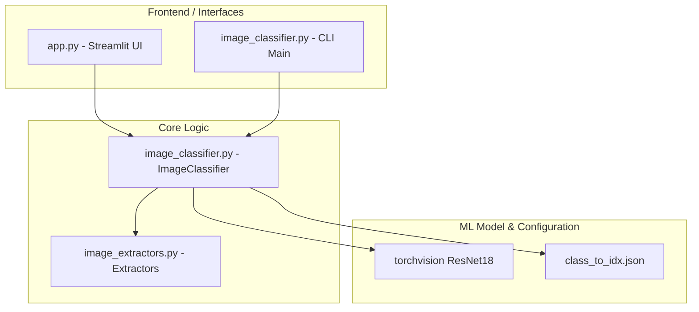

<h1 align="center">Medical vs Non‑Medical Image Classifier</h1>

<p align="center">
  
  
  
  
</p>

An end‑to‑end system to classify images as medical vs non‑medical. The system utilizes a fine-tuned ResNet18 model to categorize inputs and is accessible via both an interactive Streamlit web application and a command-line interface (CLI).

---

## Project Overview
This system classifies images into two categories: **medical** and **non-medical**. It utilizes a ResNet18 convolutional neural network (CNN) trained with PyTorch. The application provides two interfaces for prediction:
1. **Streamlit Web UI**: Allows users to upload raw images, upload PDF documents to extract and classify embedded images, or scrape and classify images from a target URL.
2. **Command-Line Interface (CLI)**: Enables automated execution, saving of outputs, display of results, and copying of uncertain predictions for auditing.

---

## Why This Project Exists
In medical informatics and clinical data management, large volumes of unorganized files and images are frequently generated. This project serves a practical triage utility: automatically sorting incoming image streams, document attachments, and web resources to separate clinical/medical imagery (e.g., X-rays, MRI scans, pathology slides) from non-clinical, general imagery. This helps streamline database indexing, protect patient privacy, and ensure data ingestion pipelines receive the correct data types.

---

## Key Features
- **Multi-Modal Image Input**: Supports direct file uploads, image extraction from PDFs, and scraping of images from web pages (URLs).
- **Interactive Streamlit Web Dashboard**: Centrally displays prediction results with visual color-coded confidence badges, interactive tables, and CSV exports.
- **Robust Inference with Test-Time Augmentation (TTA)**: Employs horizontal flip averaging to increase the reliability of predictions.
- **Confidence Thresholding / Uncertain Handling**: Classifies predictions below a configurable threshold (default: `0.60`) as `uncertain` to avoid false positives.
- **Automated CLI Utility**: Supports flexible inference via a command-line script featuring flags for custom thresholds, TTA toggles, visual displays, and structured logging.
- **Staged Transfer Learning Pipeline**: Implements staged freezing and unfreezing of layers with learning rate scheduling, class-imbalance sampling (`WeightedRandomSampler`), and early stopping.
- **SSRF Security Protection**: Actively validates input URLs against private IP subnets, loopbacks, and cloud metadata endpoints to prevent Server-Side Request Forgery.

---

## Architecture


### Module Relationships
- **`app.py`**: The web application interface. It handles user inputs (files, PDFs, URLs), coordinates classification, renders image grids with styled HTML/CSS, and handles session-based temporary directories.
- **`image_classifier.py`**: Declares the core `ImageClassifier` class and serves as the CLI entry point. It manages PyTorch model initialization, weight loading, preprocessing, TTA execution, confidence thresholding, and output rendering.
- **`image_extractors.py`**: A helper library containing standalone PDF extraction logic (via `PyMuPDF`) and web-scraping logic (via `BeautifulSoup` and `requests`), integrated with local SSRF safety verification.
- **`training_model.py`**: A script to train the model from scratch using transfer learning, custom datasets, and class-imbalance mitigations.
- **`evaluate.py`**: A script to evaluate a trained model's performance on the validation dataset.

### Tab Inference Flows in Streamlit
1. **IMAGES Tab**:
   - The user uploads one or more image files.
   - The files are saved to a temporary session directory.
   - Upon clicking "Classify images", `ImageClassifier.classify_images` is invoked.
   - Non-uncertain predictions are rendered in a 3-column grid with confidence percentages and color-coded badges, alongside a tabular preview and a CSV download button.
2. **PDF Tab**:
   - The user uploads a single PDF document.
   - The PDF is saved to the session temporary directory.
   - Upon clicking "Extract images and classify", the system extracts embedded images using PyMuPDF (limited to a maximum of 50 images).
   - Valid images are written to a temp folder, classified, and rendered.
3. **URL Tab**:
   - The user inputs an HTTP/HTTPS URL.
   - Upon clicking "Fetch images and classify", the system performs safety checks (SSRF verification) and crawls the page.
   - HTML image tags are parsed, safety-checked, and filtered by content-type. Images are downloaded (up to a maximum of 50 images) and then classified.

---

## Tech Stack
All dependencies are defined in [requirements.txt](file:///c:/Users/Shafia/PROJECTS/MediScan%20AI/requirements.txt):
- **`torch` (>=2.0.0, <3.0.0)**: Used as the core deep learning framework for model definition, inference execution, and tensor manipulations.
- **`torchvision` (>=0.15.0, <1.0.0)**: Provides the ResNet18 model architecture, ImageNet pre-trained weights, and image transform pipelines.
- **`Pillow` (>=9.5.0, <11.0.0)**: Utilized for opening, converting, verifying, and saving image files.
- **`requests` (>=2.31.0, <3.0.0)**: Used to perform HTTP GET/HEAD requests to download web pages and scrape images.
- **`beautifulsoup4` (>=4.12.0, <5.0.0)**: Used to parse HTML documents and extract target image URLs in the URL tab.
- **`pymupdf` (>=1.22.0, <2.0.0)**: Used to open PDF files, inspect page XREFs, and extract raw embedded images.
- **`matplotlib` (>=3.7.0, <4.0.0)**: Handles drawing and saving visual image grids when running in CLI display mode.
- **`numpy` (>=1.24.0, <2.0.0)**: Performs numerical arrays manipulation, softmax confidence extraction, and dataset sampling counts.
- **`streamlit` (>=1.24.0, <2.0.0)**: Used to build and serve the interactive web application dashboard.

---

## Engineering Decisions
1. **ResNet18 Baseline**: A ResNet18 model is selected because it strikes a strong balance between computational footprint and performance. With only ~11.7M parameters, it has low latency on CPUs (~50-60 ms/image) and scales efficiently on GPUs.
2. **Staged Fine-Tuning**: In training, the backbone layers are initially frozen, and only the final classification head (`fc`) is trained (using a higher learning rate of `1e-3` for 3 warm-up epochs). Subsequently, all layers are unfrozen and trained at a lower learning rate of `3e-4` to adapt features without causing catastrophic forgetting.
3. **Imbalance Mitigation via WeightedRandomSampler**: To handle unequal distribution of training images between classes, a `WeightedRandomSampler` is utilized. It calculates weights inversely proportional to class frequencies, ensuring the network is exposed to classes evenly during training.
4. **Test-Time Augmentation (TTA)**: During prediction, TTA generates predictions for both the original image and its horizontally-flipped counterpart, averaging the output probabilities. This reduces sensitivity to orientation and improves robustness.
5. **Confidence Thresholding**: Predictions with maximum softmax probabilities below the threshold (default `0.60`) are classified as `uncertain`. In the Streamlit UI, these are filtered out of the main grid per product specifications to prevent displaying low-confidence outputs.

---

## AI Components
- **Classifier Backbone**: PyTorch ResNet18 pre-trained on ImageNet.
- **Classification Head**: A replaced linear layer (`nn.Linear`) mapping the 512 backbone output features to the 2 target classes (`medical` and `non_medical`).
- **Data Normalization**: Prior to model entry, input images are resized to $256 \times 256$, cropped to the center $224 \times 224$, and normalized using standard ImageNet mean parameters `[0.485, 0.456, 0.406]` and standard deviations `[0.229, 0.224, 0.225]`.
- **Test-Time Augmentation**: Predicts on the input image and a horizontally flipped copy (implemented as `np.ascontiguousarray(np.array(image)[:, ::-1, :])`) and takes the mean of their softmax probabilities.

---

## User Flow
### Streamlit Web UI Flow
1. **Accessing the App**: Navigate to the Streamlit local URL.
2. **Selecting Mode**: Choose one of the three tabs:
   - **IMAGES**: Drag and drop or browse local image files, then click "Classify images".
   - **PDF**: Upload a `.pdf` file, then click "Extract images and classify".
   - **URL**: Type or paste a public web address, then click "Fetch images and classify".
3. **Viewing Results**: Confident classifications (confidence $\ge$ threshold) appear in a visual grid labeled with green (`Medical`) or red (`Non-Medical`) badges. A summary showing total items processed and count of excluded uncertain items is displayed.
4. **Exporting**: Review the results table at the bottom and click "Download CSV" to save.

### CLI Flow
1. **Initialization**: Invoke `python image_classifier.py` passing a required `--input` argument pointing to a PDF file path or HTTP/HTTPS webpage URL.
2. **Processing**: The CLI logs phase progress (fetching, extracting, classifying).
3. **Summary Output**: Prints a formatted ASCII text box showing statistics (Total processed, Medical count, Non-medical count, Uncertain count) and detailed per-image classifications.
4. **Interactive (Optional)**: If `--display` is specified, a Matplotlib window opens to render labeled thumbnails. If running in headless mode, it saves the visualization as `classification_display.png`.

---

## Folder Structure
```
MediScan AI/
├── app.py                         # Streamlit UI front-end implementation
├── image_classifier.py            # Core Classifier class and CLI runner
├── image_extractors.py            # PDF and URL extraction/scraping libraries
├── training_model.py              # Transfer learning training pipeline script
├── evaluate.py                    # Evaluator script for local validation sets
├── class_to_idx.json              # Class mapping index dictionary (Checked-in)
├── requirements.txt               # Locked project dependencies
├── .gitignore                     # Git ignore file
└── data/                          # Dataset directory (User must populate)
    ├── train/                     # Training dataset partition
    │   ├── medical/               # Labeled medical images directory
    │   └── non_medical/           # Labeled non-medical images directory
    └── val/                       # Validation dataset partition
        ├── medical/               # Validation medical images
        └── non_medical/           # Validation non-medical images
```

> [!NOTE]
> `image_classification_model.pth` is the trained weights file. It is a training-time artifact **not** checked into this repository. It must be generated by running `training_model.py` or placed manually in the project root folder prior to running predictions or evaluations.

---

## Installation Guide
### Prerequisites
- Python 3.9+ (due to typing annotations like `list[str]` and `tuple[str, str]` utilized in code).
- A populated local dataset under `data/` if you intend to train or evaluate.

### Steps
1. Clone this repository to your local system:
   ```bash
   git clone <repository_url>
   cd "MediScan AI"
   ```
2. Create and activate a Python virtual environment:
   ```bash
   python -m venv venv
   # On Windows:
   venv\Scripts\activate
   # On macOS/Linux:
   source venv/bin/activate
   ```
3. Install the required libraries:
   ```bash
   pip install -r requirements.txt
   ```
4. Prepare your dataset folders by populating the following directories with labeled images:
   - `data/train/medical/`
   - `data/train/non_medical/`
   - `data/val/medical/`
   - `data/val/non_medical/`

---

## Running The Project
### 1. Training the Model
To train the ResNet18 model using transfer learning on your custom dataset:
```bash
python training_model.py
```
This script will output epoch progress, unfreeze layers on epoch 4, run early stopping if validation loss plateaus, and save the best state dictionary to `image_classification_model.pth` and mappings to `class_to_idx.json`.

### 2. Streamlit Web Interface
To run the interactive web application:
```bash
python -m streamlit run app.py
```

### 3. Command Line Interface (CLI)
To process inputs via the CLI:
```bash
python image_classifier.py --input <path_to_pdf_or_url> [flags]
```

#### CLI Arguments and Flags
- `--input` *(Required)*: The input to analyze. Must be a path to a `.pdf` file or an HTTP/HTTPS URL.
- `--model` *(Default: `image_classification_model.pth`)*: Path to the trained PyTorch model weights.
- `--display` *(Flag)*: Displays a visual grid of images and predictions. Saves to `classification_display.png` if running in headless environments.
- `--save-results` *(Flag)*: Saves raw text outputs containing classifications and confidence levels to `classification_results.txt`.
- `--uncertain-threshold` *(Default: `0.60`)*: Softmax probability threshold below which predictions are labeled `uncertain`.
- `--no-tta` *(Flag)*: Disables test-time augmentation (averaging horizontal flips) for faster execution.
- `--save-uncertain` *(Flag)*: Copies images categorized as `uncertain` to a separate review directory.
- `--uncertain-dir` *(Default: `uncertain_images`)*: Target directory for storing copied uncertain images when `--save-uncertain` is used.

---

## Deployment Guide
The web application can be deployed on any virtual machine, container (e.g., Docker), or application hosting platform (such as Streamlit Community Cloud or Hugging Face Spaces):
1. Ensure the system environment runs Python 3.9+.
2. Make sure the dependencies from `requirements.txt` are successfully installed.
3. Ensure a pre-trained `image_classification_model.pth` and matching `class_to_idx.json` are present in the application root directory.
4. Run the web server command:
   ```bash
   python -m streamlit run app.py --server.port 8501 --server.address 0.0.0.0
   ```

> [!WARNING]
> **Outbound Network Security Note**: The URL image fetching feature initiates outbound HTTP requests via `requests.get` to target URLs. If deployed inside a corporate network or private cloud, ensure network rules restrict access or isolate the host container to prevent SSRF vulnerabilities, although basic validation check rules are implemented in `image_extractors.py`.

---

## Screenshots Section
*Note: Below are placeholder image references to be replaced with actual screenshots of the application in operation.*

- **Images Tab Upload & Classification Grid**:
  ``
- **PDF Tab Extraction & Classification Results**:
  ``
- **URL Tab Scraper & Page Image Classification**:
  ``
- **Interactive Results Table & CSV Export Button**:
  ``

---

## Performance Considerations
- **Model Latency**: ResNet18 runs single-image inference in ~50-60 ms on standard CPUs, making it ideal for real-time web application feedback. GPUs are auto-selected when available.
- **TTA Overhead**: Test-time augmentation (TTA) doubles the processing cost (~2x inference time per image) because it evaluates two variations of each image. CLI users can bypass this using the `--no-tta` flag.
- **Batch Sizing**: The Streamlit interface passes images sequentially (batch size of 1) to optimize memory usage and avoid OOM scenarios during concurrent file uploads.
- **I/O Filtering**: Extracted PDF and URL files under 100 bytes are skipped automatically as corrupted. Image files are checked using Pillow's `verify()` function before classification to bypass broken images.

---

## Security Considerations
- **Outbound HTTP / SSRF Protection**: The URL-scraping feature executes outbound network requests. `image_extractors.py` includes validation checks using `socket.getaddrinfo` to resolve and block hostnames pointing to loopbacks (`127.0.0.1`), private networks (`10.0.0.0/8`, `172.16.0.0/12`, `192.168.0.0/16`), link-local IPs, and cloud metadata environments (`169.254.169.254`).
- **Temporary File Handling**: Web uploads, PDF-extracted images, and URL-scraped images are written to temporary folders created via `tempfile.mkdtemp`. These directories are registered with Python's `atexit` module to ensure they are cleaned up and deleted from the local disk when the web server process exits.
- **Authentication**: The Streamlit app does not implement any authentication, authorization, or access control. By default, it is fully accessible to anyone with network access to the server port.

---

## Challenges Solved
- **Class Imbalance**: Mitigated by writing a weighted sampler calculation into the training loader setup, balancing backprop gradients over unequal image pools.
- **Robustness in Varied Contexts**: Resolved using both heavy training augmentation (crops, jitter, rotations) and test-time horizontal flip averaging.
- **False Positive Control**: Managed by classifying low-confidence predictions as `uncertain`, preventing clinical pipelines from processing questionable images.

---

## Lessons Learned
- **TTA Tradeoffs**: Incorporating TTA provides measurable prediction robustness against slight angle and framing changes, but introduces a 2x inference latency penalty. For large documents, disabling TTA is a critical option for usability.
- **Confidence Calibration**: Using simple softmax output for confidence thresholding is computationally free but requires empirical tuning (resulting in the default `0.60` threshold) to balance true positive recall against error rates.

---

## Resume Highlights
- **End-to-End Deep Learning Pipeline**: Developed a complete custom image classification pipeline, spanning dataset preparation, weighted class sampling, staged transfer learning training, validation metrics calculation, and deployment.
- **Multi-Modal Data Extraction**: Designed resilient data ingestion layers capable of parsing and extracting embedded images from PDF binary documents and scraping HTML web resources securely.
- **SSRF Safe Web Scraper**: Implemented network-level validation check systems (DNS resolution and private subnets checking) to securely crawl public assets.
- **Configurable CLI Tool**: Created a full argparse-driven CLI module featuring automated result logging, conditional image display, and automatic headless fallback saving.

---

## License
This project is for educational and research purposes.

---

## Accuracy Results on a Small Validation Set
Evaluated on `data/val` using `evaluate.py` with threshold 0.60 and TTA disabled:

```text
Overall accuracy: 100.0% (101/101)
Per‑class accuracy: medical 100.0%, non_medical 100.0%
Uncertain predictions: 0
Avg inference time: ~52.09 ms/image on CPU (ResNet18)
```

### Context and Caveats
- **Sample Counts**: The evaluation script prints the total sample count (101/101) and per-class percentages, but does not output specific per-class sample counts.
- **Small Validation Set Caveat**: This accuracy is evaluated on a small validation set. Real-world accuracy will vary with data distribution and image quality. Consider a larger, stratified test set and k-fold validation for stronger estimates.

### Troubleshooting Tips
- **"Model file not found"**: Train first (`python training_model.py`) or place `image_classification_model.pth` in the project root.
- **PDF or URL extraction issues**: Ensure `pymupdf`, `requests`, and `beautifulsoup4` are installed and the source contains extractable images.
- **CUDA issues**: The code falls back to CPU automatically.
- **Missing Dataset Folders**: Ensure you have populated the `data/train` and `data/val` directory structures as detailed in the Installation Guide before executing training or evaluation.
